# 🍽️ Carvane - Intelligent Restaurant Management System

<div align="center">
  
  
  **A comprehensive AI-powered restaurant management platform with intelligent cooking assistance, payment processing, and multi-platform support**
  
  [](https://fastapi.tiangolo.com/)
  [](https://nextjs.org/)
  [](https://golang.org/)
  [](https://swift.org/)
  [](https://mongodb.com/)
  [](https://qdrant.tech/)
</div>

## 🌟 Overview

Carvane is a revolutionary restaurant management system that combines artificial intelligence, modern web technologies, and mobile applications to create an intelligent cooking and payment ecosystem. The platform features AI-powered cooking assistance, seamless payment processing with Chargily integration, and comprehensive management tools for restaurants.

### 🎯 Key Features

- **🤖 AI-Powered Cooking Assistant**: Intelligent recipe guidance with voice control and step-by-step instructions
- **💳 Integrated Payment Processing**: Seamless Chargily payment integration for Algerian market
- **📱 Multi-Platform Support**: Web dashboard, mobile app, and restaurant worker interface
- **🔍 Vector Search**: Qdrant-powered semantic search for recipes and ingredients
- **📊 Analytics & Reporting**: Comprehensive insights and performance tracking
- **🎤 Voice Control**: Hands-free cooking assistance with speech recognition
- **🔄 Real-time Updates**: Live order tracking and payment status monitoring

## 🏗️ Architecture

<p align="center">
  
</p>


## 🚀 Quick Start

### Prerequisites

- Docker & Docker Compose
- Node.js 18+ (for local development)
- Go 1.21+ (for backend development)
- Python 3.11+ (for AI backend)

### 1. Clone the Repository

```bash
git clone https://github.com/your-org/carvane.git
cd carvane
```

### 2. Environment Setup

Create a `.env` file in the root directory:

```env
# AI Backend Configuration
OPENAI_API_KEY=your_openai_api_key_here
CHARGILY_API_KEY=your_chargily_api_key_here
CHARGILY_SECRET_KEY=your_chargily_secret_key_here
CHARGILY_WEBHOOK_SECRET=your_webhook_secret_here

# Database Configuration
POSTGRES_USER=user
POSTGRES_PASSWORD=password
POSTGRES_DB=poli_db

# MongoDB Configuration
MONGO_INITDB_ROOT_USERNAME=root
MONGO_INITDB_ROOT_PASSWORD=example
```

### 3. Start the Application

```bash
# Start all services
docker-compose up -d

# View logs
docker-compose logs -f

# Stop services
docker-compose down
```

### 4. Access the Application

| Service | URL | Description |
|---------|-----|-------------|
| **Main Dashboard** | http://carvane.localhost | Admin and management interface |
| **Restaurant Dashboard** | http://restaurant-dashboard.carvane.localhost | Worker and kitchen interface |
| **API Backend** | http://api.carvane.localhost | Go backend API |
| **AI Backend** | http://ai.carvane.localhost | AI and payment services |
| **MinIO Console** | http://minio-console.carvane.localhost | File storage management |
| **Qdrant UI** | http://qdrant-ui.carvane.localhost | Vector database interface |
| **Traefik Dashboard** | http://localhost:8080 | Load balancer dashboard |

## 📱 Platform Components

### 🖥️ Web Applications

#### 1. **Admin Dashboard** (`frontend/`)
- **Technology**: Next.js 14, TypeScript, Tailwind CSS
- **Features**: 
  - Restaurant management and analytics
  - User management and permissions
  - Transaction monitoring
  - Real-time notifications
  - Comprehensive reporting

#### 2. **Restaurant Worker Dashboard** (`restaurant_dashboard/`)
- **Technology**: Next.js 14, TypeScript, Tailwind CSS
- **Features**:
  - AI-powered cooking assistance
  - Voice-controlled recipe execution
  - Real-time order tracking
  - Payment processing interface
  - Worker performance analytics

### 📱 Mobile Application (`mobile/`)
- **Technology**: SwiftUI, iOS
- **Features**:
  - Voice-controlled cooking assistant
  - QR code payment scanning
  - Recipe browsing and search
  - Order tracking and management
  - Offline recipe storage

### 🔧 Backend Services

#### 1. **Go Backend** (`backend/`)
- **Technology**: Go, Gin, GORM, PostgreSQL
- **Features**:
  - RESTful API endpoints
  - User authentication and authorization
  - Order management
  - Database operations
  - JWT token management

#### 2. **AI Backend** (`aibackend/`)
- **Technology**: Python, FastAPI, LangGraph, MongoDB
- **Features**:
  - Agentic AI conversation handling
  - Chargily payment integration
  - Vector search with Qdrant
  - Recipe recommendation engine
  - Voice processing and NLP

## 🤖 AI-Powered Features

### 🧠 Intelligent Cooking Assistant

The AI assistant uses advanced language models and vector search to provide:

- **Context-Aware Recipe Guidance**: Understands cooking context and provides relevant suggestions
- **Voice-Controlled Interface**: Hands-free cooking with natural language commands
- **Ingredient Substitution**: Suggests alternatives based on available ingredients
- **Cooking Technique Guidance**: Step-by-step instructions with visual aids
- **Dietary Restrictions**: Adapts recipes based on dietary requirements

### 💬 Conversational AI

```python
# Example AI conversation
user: "Je veux cuisiner un poulet rôti pour 4 personnes"
ai: "Parfait ! Je vais vous guider pour préparer un délicieux poulet rôti. 
     Avez-vous un poulet de 1.5kg environ ? Nous aurons besoin de..."
```

### 🔍 Semantic Recipe Search

Powered by Qdrant vector database:
- **Ingredient-based search**: Find recipes by available ingredients
- **Cuisine type filtering**: Filter by cuisine preferences
- **Difficulty level matching**: Match recipes to skill level
- **Nutritional information**: Search by dietary requirements

## 💳 Payment Integration

### Chargily Integration

Seamless payment processing for the Algerian market:

- **Multiple Payment Methods**: EDAHABIA, CIB, and other local options
- **Real-time Status Updates**: Webhook-based payment tracking
- **Secure Processing**: HMAC signature verification
- **Multi-currency Support**: DZD and other currencies
- **Transaction History**: Comprehensive payment tracking

### Payment Flow

```mermaid
sequenceDiagram
    participant U as User
    participant AI as AI Assistant
    participant P as Payment Service
    participant C as Chargily
    participant W as Webhook

    U->>AI: "Je veux payer 1500 DZD"
    AI->>P: Create payment request
    P->>C: Generate payment URL
    C-->>P: Return payment link
    P-->>AI: Payment URL generated
    AI-->>U: "Voici votre lien de paiement"
    U->>C: Complete payment
    C->>W: Send webhook notification
    W->>P: Update payment status
    P->>AI: Payment confirmed
    AI-->>U: "Paiement confirmé !"
```



## 🗄️ Data Architecture

### Database Schema

#### MongoDB (AI Backend)
- **Conversations**: AI chat history and context
- **Messages**: Individual chat messages
- **Payments**: Payment transactions and status

#### PostgreSQL (Go Backend)
- **Users**: User accounts and profiles
- **Restaurants**: Restaurant information
- **Orders**: Order management
- **Transactions**: Financial records

#### Qdrant (Vector Database)
- **Recipe Embeddings**: Vector representations of recipes
- **Ingredient Vectors**: Semantic ingredient representations
- **Cooking Technique Vectors**: Method and technique embeddings

## 🚀 Deployment

### Production Deployment

1. **Environment Configuration**:
   ```bash
   # Set production environment variables
   export NODE_ENV=production
   export DATABASE_URL=your_production_db_url
   export OPENAI_API_KEY=your_production_key
   ```

2. **Docker Production Build**:
   ```bash
   # Build production images
   docker-compose -f docker-compose.prod.yml build
   
   # Deploy to production
   docker-compose -f docker-compose.prod.yml up -d
   ```

3. **Health Monitoring**:
   ```bash
   # Check service health
   curl http://your-domain.com/health
   curl http://your-domain.com/api/health
   ```

### Scaling Considerations

- **Horizontal Scaling**: Multiple backend instances behind load balancer
- **Database Optimization**: Read replicas and connection pooling
- **Caching Strategy**: Redis for session and API response caching
- **CDN Integration**: Static asset delivery optimization

## 🔧 Development

### Local Development Setup

1. **Backend Development**:
   ```bash
   cd backend
   go mod tidy
   go run cmd/main.go
   ```

2. **AI Backend Development**:
   ```bash
   cd aibackend
   python -m venv venv
   source venv/bin/activate
   pip install -r requirements.txt
   uvicorn main:app --reload
   ```

3. **Frontend Development**:
   ```bash
   cd frontend
   npm install
   npm run dev
   ```

### Testing

```bash
# Run all tests
npm test                    # Frontend tests
go test ./...              # Backend tests
pytest                     # AI backend tests

# Integration tests
docker-compose -f docker-compose.test.yml up --abort-on-container-exit
```

## 📊 Monitoring & Analytics

### Key Metrics

- **Cooking Success Rate**: Percentage of successfully completed recipes
- **Payment Success Rate**: Transaction completion rates
- **User Engagement**: Active users and session duration
- **AI Response Time**: Average AI response latency
- **System Performance**: API response times and error rates

### Logging

- **Structured Logging**: JSON-formatted logs across all services
- **Centralized Logging**: ELK stack for log aggregation
- **Error Tracking**: Sentry integration for error monitoring
- **Performance Monitoring**: APM tools for performance insights

## 🤝 Contributing

We welcome contributions! Please see our [Contributing Guidelines](CONTRIBUTING.md) for details.

### Development Workflow

1. Fork the repository
2. Create a feature branch
3. Make your changes
4. Add tests
5. Submit a pull request

## 📄 License

This project is licensed under the MIT License - see the [LICENSE](LICENSE) file for details.

## 🆘 Support

- **Documentation**: [docs.carvane.com](https://docs.carvane.com)
- **Issues**: [GitHub Issues](https://github.com/your-org/carvane/issues)
- **Discord**: [Join our community](https://discord.gg/carvane)
- **Email**: support@carvane.com

## 🙏 Acknowledgments

- **OpenAI** for providing the language models
- **Chargily** for payment processing integration
- **Qdrant** for vector search capabilities
- **The open-source community** for the amazing tools and libraries

---

<div align="center">
  <p>Made with ❤️ by the Carvane Team</p>
  <p>© 2024 Carvane. All rights reserved.</p>
</div>
